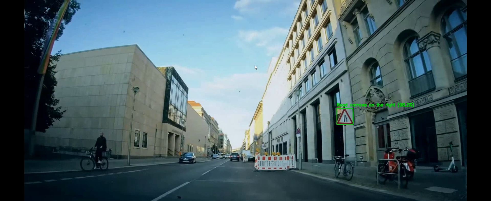
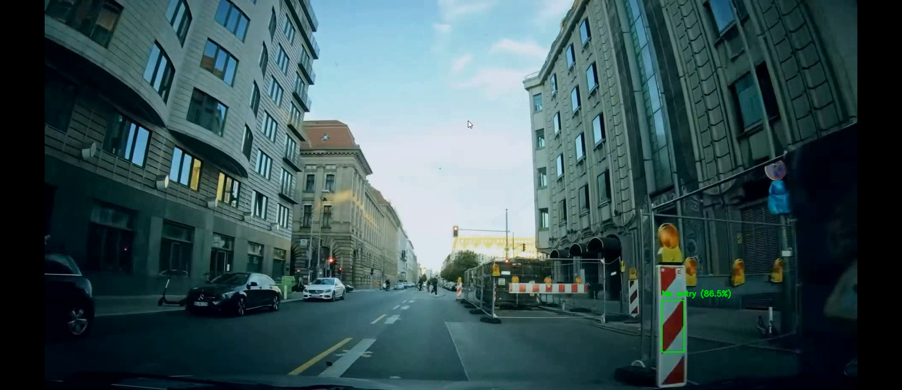
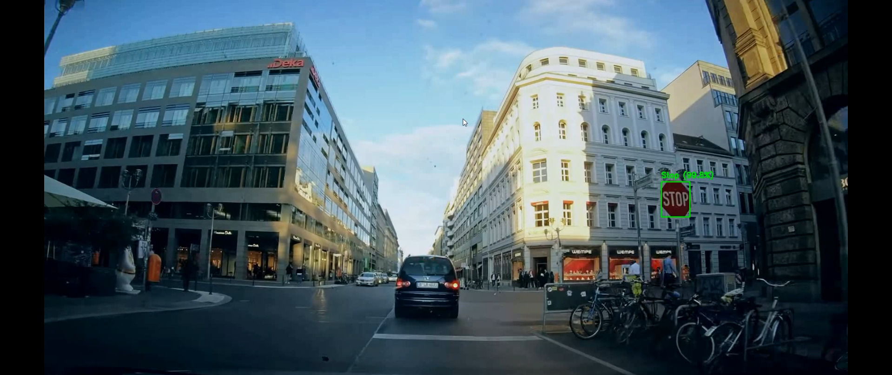
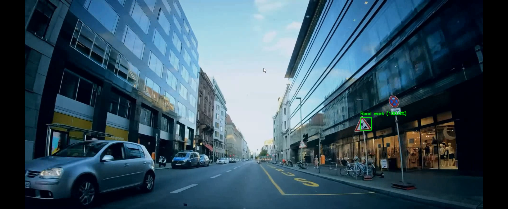
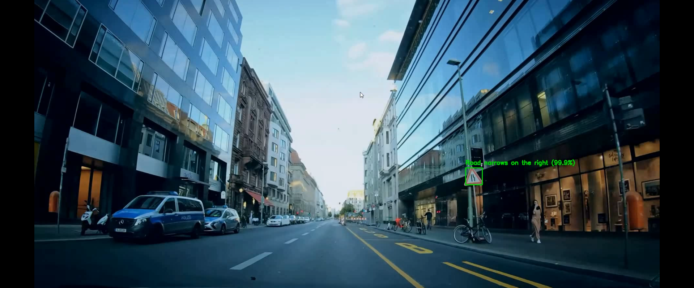

# 🚦 Traffic Sign Recognition using MobileNetV2 (TensorFlow)

A deep-learning–based **Traffic Sign Classification** system built using **TensorFlow + MobileNetV2 Transfer Learning**.  
The model is trained on 43 traffic sign classes and achieves **high accuracy** after fine-tuning.

This repository includes:
- Dataset processing
- Training pipeline
- Fine-tuning strategy
- Inference on images + video frames
- Example detection screenshots

---

## 📂 Dataset — German Traffic Sign Recognition Benchmark (GTSRB)

The model uses the **GTSRB** dataset containing:

- **43 classes**
- **50,000+ images**
- Images ranging from **30×30 to 150×150**  
- Varying lighting, angles, and motion blur  
- Multi-class classification problem  

---

## 🧠 Model Architecture

The model uses **MobileNetV2** as the base feature extractor.

- **Backbone:** MobileNetV2 (pretrained on ImageNet)
- **Input size:** 224 × 224 × 3
- **Top Layers Added:**
  - GlobalAveragePooling2D  
  - Dense (128) + ReLU  
  - Dropout (0.3)  
  - Dense (43) + Softmax

---

## 🔧 Training Pipeline

### **1️⃣ Data Augmentation**
- rotation_range: 20
- width_shift_range: 0.2
- height_shift_range: 0.2
- shear_range: 0.2
- zoom_range: 0.2
- brightness_range: [0.8, 1.2]
- validation_split: 0.2


### **2️⃣ Phase-1 Training (Frozen Backbone)**  
- Train only classifier head  
- MobileNetV2 layers frozen  
- Learning rate: **1e-3**

**Results:**
- Accuracy: 0.6466
- Loss: 1.1047
- Validation Accuracy: 0.5826
- Validation Loss: 1.4300

### **3️⃣ Phase-2 Fine-Tuning (Unfreeze Last 30 Layers)**  
- Fine-tune deeper layers  
- Learning rate: **1e-4**

**Results:**
- Accuracy: 0.9620
- Loss: 0.1129
- Validation Accuracy: 0.8610
- Validation Loss: 0.5383

The model was evaluated on actual driving footage.  
It predicts:

- Bounding box  
- Class name  
- Confidence score

### **📸 Example Detection Frames**

| Sample 1 | Sample 2 | Sample 3 |
|---------|----------|----------|
|  |  |  |

| Sample 4 | Sample 5 |
|----------|----------|
|  |  |

---

## 📝 Class Mapping

All 43 traffic sign classes follow the official GTSRB ordering:

| Index | Class Name |
|-------|------------|
| 0 | Speed limit (20km/h) |
| 1 | Speed limit (30km/h) |
| 2 | Speed limit (50km/h) |
| 3 | Speed limit (60km/h) |
| 4 | Speed limit (70km/h) |
| 5 | Speed limit (80km/h) |
| 6 | End of speed limit (80km/h) |
| 7 | Speed limit (100km/h) |
| 8 | Speed limit (120km/h) |
| 9 | No passing |
| 10 | No passing veh > 3.5 tons |
| 11 | Right-of-way at intersection |
| 12 | Priority road |
| 13 | Yield |
| 14 | Stop |
| 15 | No vehicles |
| 16 | Veh > 3.5 tons prohibited |
| 17 | No entry |
| 18 | General caution |
| 19 | Dangerous curve left |
| 20 | Dangerous curve right |
| 21 | Double curve |
| 22 | Bumpy road |
| 23 | Slippery road |
| 24 | Road narrows right |
| 25 | Road work |
| 26 | Traffic signals |
| 27 | Pedestrians |
| 28 | Children crossing |
| 29 | Bicycle crossing |
| 30 | Beware of ice/snow |
| 31 | Wild animals |
| 32 | End of speed + passing limits |
| 33 | Turn right ahead |
| 34 | Turn left ahead |
| 35 | Ahead only |
| 36 | Go straight or right |
| 37 | Go straight or left |
| 38 | Keep right |
| 39 | Keep left |
| 40 | Roundabout |
| 41 | End of no passing |
| 42 | End no passing veh > 3.5 tons |

---

## 🛠 Installation

```bash
    pip install tensorflow opencv-python numpy matplotlib
```

## Run Inference on an Image

```bash
    img = cv2.imread("test.png")
    img_resized = cv2.resize(img, (224, 224))
    img_input = np.expand_dims(img_resized / 255.0, axis=0)
    pred = model.predict(img_input)
    print(idx_to_label[np.argmax(pred)])
```

## Run Real-Time Video Detection

```bash
    python detect_video.py --model traffic_sign_model.keras --video test.mp4
```

## 👤 Author

**Taha Hasnain Raza**  
Computer Vision & Machine Learning Engineer  

🔗 **Connect with me:**  
[LinkedIn – Taha Hasnain Raza](https://www.linkedin.com/in/taha-hasnain-raza)  
